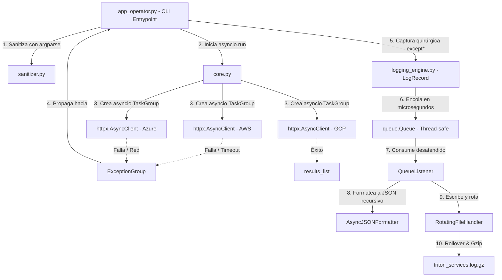

# TritonMonitor — Sistema de Telemetría Multicloud y Observabilidad Asíncrona

> **TP-1 · Unidad 1: Calidad de Software y Observabilidad**  
> **Materia:** Programación para Automatización II — 2026  
> **Carrera:** Tecnicatura Universitaria en Gestión de Infraestructura Cloud y DevOps  
> **Formador:** Lic. Juárez, Jacobo León  
> **Grupo:** 15 (`NN`)  
> **Enlace al Video de Defensa Grupal:** [Pendiente]

Monitor CLI oficial de **Triton Cloud Services**. Consulta en paralelo los nodos de telemetría de **AWS, Azure y GCP** mediante peticiones HTTP asíncronas reales contra APIs públicas en internet (`JSONPlaceholder` y `httpbin.org`), tolera latencias extremas y fallos concurrentes mediante Concurrencia Estructurada (`asyncio.TaskGroup` y `except*`), y persiste cada evento en un volcado JSON estructurado a través de un pipeline no bloqueante con rotación a 2 MB y compresión Gzip.

---

## 1. Integrantes del Grupo de Trabajo

| # | Apellido y Nombre | Rol Técnico Asignado | Módulo bajo su firma |
| :-: | :--- | :--- | :--- |
| **1** | **Ahumada, German Maximiliano Leonel** | Ingeniero de Robustez de Entradas y Excepciones | `exceptions.py`, `sanitizer.py` |
| **2** | **Ahumada, German Maximiliano Leonel** | Ingeniero de Concurrencia y Telemetría Asíncrona | `core.py` *(asumido en cobertura tras la reestructuración del grupo)* |
| **3** | **Isella, Lucia Daniza** | Ingeniera de Formateo Estructurado JSON | `logging_engine.py` (`AsyncJSONFormatter`) |
| **4** | **Vaca, Georgina Zulma** | Ingeniera de Almacenamiento y Desacoplamiento No Bloqueante | `logging_engine.py` (pipeline de cola y Gzip) |
| **5** | **Paz Villarreal, Sebastián** | Coordinador de Integración y Flujo CLI | `app_operator.py`, `__init__.py` |
| **6** | **Sosa, Tamara Gabriela** | Ingeniera de Simulación de Caos y Pruebas Forenses | `tests/`, `chaos_simulator.py` |

---

## 2. Escenario de Producción

La corporación multinacional **Triton Cloud Services** opera clústeres de cómputo críticos distribuidos simultáneamente en tres nubes públicas: **AWS, Azure y GCP**. Durante tormentas de radiación electromagnética, los nodos de telemetría sufren caídas de red, pérdidas de peering o corrupciones graves de datos de forma paralela.

Para certificar la resiliencia en condiciones reales, `TritonMonitor` interactúa con servicios públicos en internet:
* **Modo Nominal:** Consulta publicaciones de prueba en `jsonplaceholder.typicode.com` (códigos HTTP 200 con latencias menores a 100 ms).
* **Modo Caos (`--chaos`):** Consulta endpoints de estrés en `httpbin.org` (retardo de 3 segundos para timeouts, código HTTP 504 Gateway Timeout y código HTTP 422 Unprocessable Entity).

El monitor sobrevive a los fallos concurrentes sin cerrarse de forma abrupta y sin perder evidencia forense.

---

## 3. Requisitos e Instalación

### Requisitos del Sistema
* **Python 3.12 o superior** (requerido para `asyncio.TaskGroup`, `except*` de PEP 654, `add_note()` de PEP 678 y el atributo nativo `taskName`).
* Acceso a internet para la resolución de las APIs cloud públicas.

### Paso a Paso de Instalación

```bash
# 1. Clonar el repositorio
git clone https://github.com/Mikoo/Triton.git
cd Triton

# 2. Crear el entorno virtual aislado (.venv)
python -m venv .venv

# 3. Activar el entorno virtual
# En Windows (PowerShell):
.\.venv\Scripts\Activate.ps1
# (En caso de restricción de ejecución en PowerShell, ejecutar: Set-ExecutionPolicy -Scope Process -ExecutionPolicy Bypass)

# En Windows (CMD):
.venv\Scripts\activate.bat

# En Linux / macOS:
source .venv/bin/activate

# 4. Instalar las dependencias del proyecto
pip install -r requirements.txt

# 5. Verificar la instalación y ver la ayuda
python src/app_operator.py --help
```

---

## 4. Uso de la Interfaz de Línea de Comandos (CLI)

```bash
python src/app_operator.py <proveedores> -c <cluster-id> [opciones]
```

| Parámetro / Opción | Tipo | Obligatorio | Descripción y Restricciones |
| :--- | :---: | :---: | :--- |
| `proveedores` | Posicional | **Sí** | Uno o más proveedores a monitorear: `AWS`, `Azure`, `GCP`. |
| `-c`, `--cluster` | Opción | **Sí** | Identificador de clúster con patrón estricto: `cluster-<region>-<numero>` (ej.: `cluster-us-east-01`). |
| `-t`, `--timeout` | Opción | No | Ventana de espera de red. Flotante acotado estrictamente en `[0.1, 5.0]` segundos (defecto: `2.5`). |
| `-m`, `--modo` | Opción | No | Modo operativo de la CLI: `nominal`, `debug`, `emergency` (defecto: `nominal`). |
| `--chaos` | Bandera | No | Fuerza la inyección de caos y fallos de red en caliente contra `httpbin.org`. |
| `-o`, `--output` | Opción | No | Ruta personalizada del archivo de log (defecto: `triton_services.log`). |
| `-v` / `-q` | Banderas | No | Nivel de detalle en consola: `--verbose` o `--quiet` (mutuamente excluyentes). |

---

## 5. Arquitectura del Sistema

El siguiente diagrama ilustra la interacción entre la frontera CLI, la concurrencia estructurada y el pipeline de persistencia desacoplado:



### 5.1. Desacoplamiento de I/O en Hilos
El bucle de eventos de `asyncio` corre en un único hilo y **nunca realiza escrituras síncronas a disco**. La corrutina deposita el evento en una cola sincronizada en memoria RAM (`queue.Queue`) en microsegundos y continúa atendiendo sockets de red. Un hilo secundario independiente (`QueueListener`) consume los registros y ejecuta la persistencia física en disco.

---

## 6. Decisiones de Diseño Destacadas

1. **Jerarquía de Excepciones sin `BaseException`:**  
   Heredar de `BaseException` secuestraría señales vitales del sistema operativo como `KeyboardInterrupt` (`Ctrl + C`), impidiendo que el operador detenga el monitor ante una emergencia. Por ello, `TritonError` deriva estrictamente de `Exception`.
2. **Concurrencia Estructurada con `TaskGroup` en lugar de `gather`:**  
   `asyncio.gather` deja tareas huérfanas en ejecución si una de ellas falla. `TaskGroup` garantiza ciclo de vida acotado, cancelación limpia y empaquetamiento atómico de todas las fallas simultáneas en un `ExceptionGroup`.
3. **Preservación de Excepciones en `NonBlockingQueueHandler`:**  
   La implementación estándar de `QueueHandler.prepare()` borra el atributo `exc_info` al encolar. La subclase preserva el registro intacto para que `AsyncJSONFormatter` pueda expandir el árbol completo de excepciones en el hilo consumidor.
4. **Compresión Atómica en Caliente (Hot Gzip):**  
   Al alcanzar los 2 MB, el archivo activo rota. Los callbacks `gzip_namer` y `gzip_rotator` comprimen el histórico cerrado a formato binario `.gz` y eliminan de inmediato el archivo plano residual, ahorrando un 85% de espacio en disco y evitando la saturación del almacenamiento.

---

## 7. Cumplimiento de Estándares (Hard Gates)

| Requisito Mandatorio | Implementación Técnica | Estado |
| :--- | :--- | :---: |
| **No heredar de `BaseException`** | `TritonError` y todas sus subclases derivan estrictamente de `Exception`. | Cumplido |
| **Prohibido `except: pass`** | Cero silenciamiento ciego de errores; cada incidente es tipado y registrado. | Cumplido |
| **Cumplimiento PEP 765** | Los bloques `finally` no contienen sentencias `return`, `break` ni `continue`. | Cumplido |
| **Aislamiento de I/O en AsyncIO** | Escritura física delegada al hilo secundario `QueueListener` vía `queue.Queue`. | Cumplido |
| **Rotación acotada a 2 MB y Gzip** | `RotatingFileHandler` limitado a 2 MB con 3 backups y compresión automática `.gz`. | Cumplido |
| **Timestamp ISO 8601 UTC** | Fechas normalizadas en UTC con sufijo `Z` vía `datetime.now(timezone.utc)`. | Cumplido |
| **PEP 654 (`except*`)** | Bloques quirúrgicos independientes en `app_operator.py`. | Cumplido |
| **PEP 678 (`add_note`)** | Inyección de notas forenses dinámicas en excepciones de timeout y red. | Cumplido |

---

## 8. Guía de Ejecución de los 3 Escenarios

### Escenario A — Operación Nominal Completa (Éxito Rotundo)
```bash
python src/app_operator.py AWS GCP -c cluster-us-east-01 -t 3.0
```
* **Comportamiento:** Peticiones HTTP concurrentes a internet con código 200. Reporte nominal en consola con latencias en milisegundos y registro estructurado en `triton_services.log` (código de salida `0`).

---

### Escenario B — Validación Temprana en Frontera CLI (Sanitización)
```bash
python src/app_operator.py AWS GCP -c cluster-invalido-id -t 9.5
```
* **Comportamiento:** `argparse` captura el error en la frontera antes de abrir conexiones o iniciar `asyncio`. Muestra el mensaje de ayuda en stderr y sale limpiamente con código de sistema `2`.

---

### Escenario C — Inyección de Caos y Captura Quirúrgica `except*`
```bash
python src/app_operator.py AWS Azure GCP -c cluster-us-west-02 -t 1.5 --chaos
```
* **Comportamiento:** AWS colapsa por timeout real (retardo de 3 s en `httpbin.org`), Azure y GCP colapsan con errores HTTP 504 y 422. `TaskGroup` propaga un `ExceptionGroup` que es capturado quirúrgicamente por los bloques `except*`, mostrando las notas forenses en consola y registrando el incidente completo en `triton_services.log` sin cierres abruptos.

---

## 9. Formato del Volcado de Telemetría (JSON Lines)

Cada evento registrado en `triton_services.log` es un objeto JSON independiente:

```json
{
  "timestamp": "2026-09-03T03:00:15.124Z",
  "level": "INFO",
  "logger": "triton",
  "message": "Telemetría recibida exitosamente",
  "process": 1284,
  "threadName": "ThreadPoolExecutor-0_0",
  "taskName": "TelemetryTask-AWS",
  "filename": "core.py",
  "line": 85,
  "function": "scan_provider",
  "cluster_id": "cluster-us-east-01",
  "provider": "AWS",
  "latency_ms": 68.42,
  "status_code": 200
}
```

Ante un incidente, se inyecta el árbol jerárquico `exception` conteniendo el tipo de error, mensaje, notas forenses (`__notes__`), causas encadenadas (`__cause__`) y sub-excepciones del `ExceptionGroup`.

---

## 10. Suite de Pruebas y Validación Automatizada

El proyecto cuenta con **83 pruebas automatizadas** que cubren el 100% de los módulos y requerimientos de la cátedra:

```bash
# Ejecutar todas las pruebas con Pytest (83 tests en verde)
pytest -v

# Ejecutar el simulador integral de caos y auditoría forense de logs y Gzip
python chaos_simulator.py
```

---

## 11. Notas de Seguridad y Credenciales

Este monitor de telemetría está diseñado para consultar exclusivamente servicios públicos de prueba sin autenticación (`JSONPlaceholder` y `httpbin.org`). Por diseño, el repositorio **no requiere, no utiliza ni almacena ninguna clave de API, contraseña ni dato sensible**.