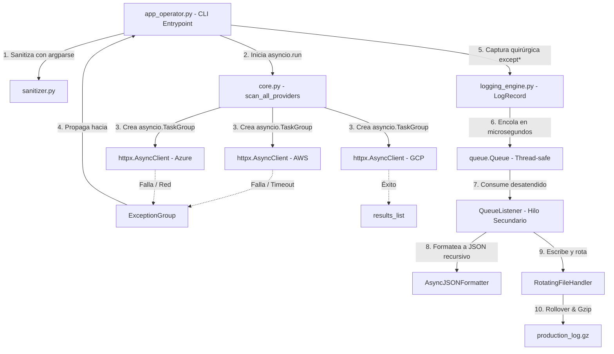

# TP-1: Sistema de Telemetría Multicloud y Observabilidad Asíncrona (Proyecto Tritón)

Triton Cloud Services — Monitor de Resiliencia Asíncrona y Observabilidad Forense

---

## 1. Descripción del Proyecto

Triton Cloud Services opera clústeres de cómputo distribuidos simultáneamente en tres proveedores cloud: AWS, Azure y GCP. Ante eventos de degradación de red, pérdida de peering o corrupción de datos, el monitor CLI `TritonMonitor` evalúa el estado operativo de los nodos mediante peticiones HTTP asíncronas hacia APIs reales en internet (`JSONPlaceholder` y `httpbin.org`).

### Características Principales
- **Concurrencia Estructurada:** Orquestación paralela mediante `asyncio.TaskGroup`.
- **Mapeo Semántico de Excepciones:** Jerarquía de errores de dominio derivada de `Exception` y captura quirúrgica con `except*`.
- **Aislamiento de I/O:** Pipeline de logging no bloqueante mediante `QueueHandler` y `QueueListener` en hilos secundarios.
- **Observabilidad Forense:** Serialización recursiva a formato JSON estructurado con marcas de tiempo ISO 8601 UTC.
- **Almacenamiento Acotado:** Rotación de archivos de log a 2 MB con 3 backups y compresión atómica en caliente a formato `.gz`.

---

## 2. Diagrama de Arquitectura



---

## 3. Estructura Modular del Repositorio

```text
triton_monitor/
├── src/
│   ├── triton_telemetry/
│   │   ├── __init__.py          # Exportación de API pública (__all__)
│   │   ├── exceptions.py        # Excepciones semánticas (TritonError y subclases)
│   │   ├── sanitizer.py         # Validadores declarativos para argparse
│   │   ├── core.py              # Telemetría HTTP asíncrona (TaskGroup + httpx)
│   │   └── logging_engine.py    # Formateador JSON y pipeline no bloqueante con Gzip
│   └── app_operator.py          # Punto de entrada CLI con captura except*
├── tests/
│   ├── __init__.py
│   ├── test_sanitizer.py        # Pruebas de límites y validación regex
│   ├── test_exceptions.py       # Pruebas de jerarquía de excepciones
│   ├── test_core.py             # Pruebas asíncronas con MockTransport
│   ├── test_logging_engine.py   # Pruebas de serialización JSON y rotación Gzip
│   └── test_chaos_simulation.py # Pruebas integrales de escenarios A, B y C
├── chaos_simulator.py           # Script de simulación de fallos y auditoría forense
├── conftest.py                  # Configuración de rutas para pytest
├── requirements.txt             # Dependencias del proyecto
└── README.md                    # Documentación técnica
```

---

## 4. Distribución de Roles del Equipo

| Integrante | Rol Técnico | Módulos Asignados | Responsabilidades |
| :--- | :--- | :--- | :--- |
| **Integrante 1** | Ingeniero de Robustez de Entradas y Excepciones | `exceptions.py`<br>`sanitizer.py` | Excepciones semánticas (no `BaseException`) y validación de parámetros CLI (`--timeout`, `--cluster`). |
| **Integrante 2** | Ingeniero de Concurrencia y Telemetría Asíncrona | `core.py` | Consumo HTTP asíncrono con `httpx`, orquestación con `TaskGroup` y notas forenses (`add_note`). |
| **Integrante 3** | Ingeniero de Formateo Estructurado JSON | `logging_engine.py` | Clase `AsyncJSONFormatter`, serialización recursiva de `ExceptionGroup` y marcas ISO 8601 UTC. |
| **Integrante 4** | Ingeniero de Almacenamiento y Desacoplamiento No Bloqueante | `logging_engine.py` | Pipeline `QueueHandler`/`QueueListener`, `RotatingFileHandler` (2 MB, 3 backups) y compresión Gzip. |
| **Integrante 5** | Coordinador de Integración y Flujo CLI | `__init__.py`<br>`app_operator.py` | Entrypoint declarativo con `argparse`, captura quirúrgica con `except*` y cumplimiento PEP 765. |
| **Integrante 6** | Ingeniero de Simulación de Caos y Pruebas Forenses | `tests/*`<br>`chaos_simulator.py` | Suite de pruebas unitarias/integración (`pytest`) y validador de telemetría JSON. |

---

## 5. Cumplimiento de Estándares de Producción (Hard Gates)

- **No herencia de `BaseException`:** `TritonError` y sus subclases heredan estrictamente de `Exception` para evitar capturar señales críticas del sistema operativo (`SIGINT`, `KeyboardInterrupt`).
- **Sin silenciamiento ciego:** Prohibido el uso de `except: pass`. Toda excepción es procesada y registrada.
- **Cumplimiento PEP 765:** Los bloques `finally` no contienen sentencias `return`, `break` ni `continue`.
- **Aislamiento de I/O en AsyncIO:** Las corrutinas envían logs a memoria RAM en microsegundos; la persistencia física en disco se ejecuta en un hilo secundario independiente (`QueueListener`).
- **Rotación y Compresión Gzip:** Manejador rotativo acotado a 2 MB con 3 backups, compresión atómica a `.gz` y eliminación segura del archivo plano residual.
- **Formato ISO 8601 UTC:** Marcas temporales normalizadas en UTC con `datetime.now(timezone.utc)`.

---

## 6. Instalación y Dependencias

### Requisitos
- Python 3.12 o superior.

### Instalación
```bash
pip install -r requirements.txt
```

---

## 7. Guía de Ejecución

### Escenario A: Operación Nominal Completa
Ejecución concurrente hacia AWS y GCP con parámetros válidos:
```bash
python src/app_operator.py AWS GCP -c cluster-us-east-01 -t 3.0
```
- **Resultado:** Peticiones paralelas en milisegundos, reporte nominal en stdout y código de retorno `0`.

### Escenario B: Validación Temprana en Frontera CLI
Ejecución con identificador de clúster o timeout inválidos:
```bash
python src/app_operator.py AWS GCP -c cluster-invalido-id -t 9.5
```
- **Resultado:** `argparse` aborta inmediatamente con código de retorno `2` sin iniciar el bucle de eventos asíncrono.

### Escenario C: Inyección de Caos y Captura Quirúrgica `except*`
Ejecución forzando fallos de red y latencias altas en caliente:
```bash
python src/app_operator.py AWS Azure GCP -c cluster-us-west-02 -t 1.5 --chaos
```
- **Resultado:** `TaskGroup` propaga un `ExceptionGroup`, los bloques `except*` capturan selectivamente timeouts y fallos HTTP, y se persiste el volcado forense estructurado en `triton_services.log`.

---

## 8. Ejecución de Pruebas

### Suite de Pruebas Unitarias e Integración (50 Tests)
```bash
pytest -v tests/
```

### Simulador Automatizado de Caos y Auditoría Forense
```bash
python chaos_simulator.py
```
